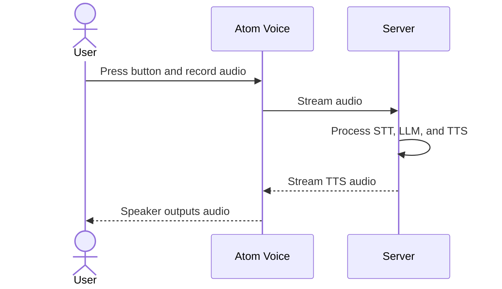
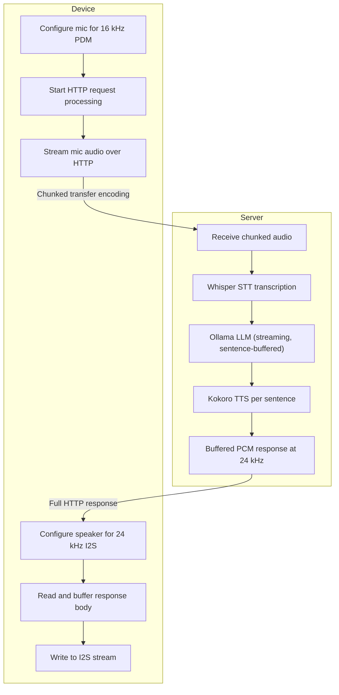

The idea for this project came from a conversation I had with a coworker. Both of our grandparents had been dealing with dementia, and we noticed how often they struggled to remember details or repeated the same questions. That led us to wonder whether an AI assistant could help by listening to conversations and responding with relevant context.

I haven’t implemented the full vision yet, but I’ve built a working proof of concept that can take audio input and produce spoken output.

## Motivation

This project started as a simple idea: could an AI assistant help someone remember important parts of a conversation? For families dealing with dementia, even small moments of context can make a big difference. I wanted to explore whether a voice-based system could capture that context and turn it into something useful.

## What I built

The current version is a locally hosted AI voice assistant built around an Atom Voice device from M5Stack and a server running the rest of the pipeline. The device has a button, microphone, speaker, and status LEDs. I use the button to start and stop recording, while the LEDs show whether the device is idle, recording, or waiting for a response.

When the user holds the button, the device records audio and streams it to the server. The server transcribes the audio with speech-to-text, sends the text to an LLM, and then converts the response to speech using text-to-speech. The final audio is streamed back to the device and played through the speaker.

## Current flow

## Architecture

## Implementation details

On the firmware side, I use the AudioTools library to handle audio streaming over HTTP. A single `WiFiClient` and `HttpRequest` manage the full exchange over one keep-alive connection. The microphone PCM is sent using chunked transfer encoding, and I read the response body directly to avoid chunked decoding interfering with the binary audio stream.

The server is built with FastAPI and runs inside Docker. Ollama and Kokoro live in separate containers, which makes it easy to restart the main server without disrupting the rest of the stack. I built the server inside WSL so I could practice developing in a Linux environment. The server accepts raw 16 kHz mono PCM audio, buffers LLM output until it reaches a sentence boundary, and then synthesizes each sentence with Kokoro before returning the full response as raw 24 kHz PCM.

## What’s next

There’s still a lot I want to improve. The biggest missing piece is memory: right now, the assistant can respond to a single interaction, but it doesn’t yet retain long-term context. I also want to improve response time, refine the streaming pipeline, and compare additional STT and TTS models for better quality and performance.

I’m planning to move the firmware into PlatformIO so I can merge the two repos, and I also want to move Whisper into its own Docker container to make the server architecture cleaner. This project is still evolving, but it’s already taught me a lot about embedded development, audio streaming, and building full-stack systems end to end.