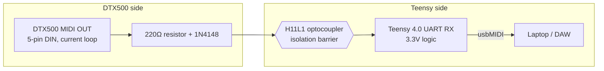

My Yamaha DTX500 drum module only has a 5-pin DIN MIDI OUT, no USB, so getting its output into my laptop meant relying on a cheap MIDI-to-USB adapter cable. That cable is flaky — every so often it spazzes out mid-performance and fires off a burst of notes I never played. So I decided to build my own bridge instead, using a Teensy 4.0, and treat it as an excuse to dust off some EE fundamentals I hadn't touched since college.

## Motivation

The project officially started 7/16, though I didn't start documenting until a few days in. The goal, as I wrote it down at the time, was simple: **receive DIN MIDI cleanly, forward it over USB reliably.**

The likely cause of the old cable's glitches is bit corruption — a single flipped bit on a noisy connection can turn a MIDI data byte into a status byte, which cascades into a burst of spurious note-on messages. That tracks with how a lot of cheap MIDI-to-USB cables are built: many skip the optocoupler on the input stage entirely to save a few cents, trading away noise immunity to do it.

## MIDI, briefly

MIDI is a specific UART implementation: 31,250 baud, 1 start bit, 8 data bits, 1 stop bit. Bytes are either command/status bytes (0x80–0xFF — Note On, Note Off, Pitch Bend, etc.) or data bytes (0x00–0x7F — pitch, velocity, and so on). On the hardware side, DIN MIDI OUT is a current loop, not a voltage-level signal: pin 4 is the voltage reference, pin 5 carries data, pins 1 and 3 are unused. The spec also caps cable length at 50 feet, since long copper runs build up enough capacitance to round out the signal edges — and by the far end, the current may be too weak to reliably trigger a receiving optocoupler.

## Why isolation matters

The central design decision here is the optocoupler on the input stage. An optocoupler lets data cross from one circuit into another without a direct electrical connection — the incoming signal blinks an LED, and a phototransistor on the other side of a plastic barrier picks the light back up and converts it back into an electrical signal.

That barrier matters because of ground loops: when multiple devices share a ground path, differences in ground potential can drive unwanted current between them, and the resulting circulating currents induce noise of their own. A laptop, an audio interface, and a drum module all sharing a desk (and often a wall outlet) is basically a guarantee of one. An optocoupler breaks that shared path — it can pass a control signal across the isolation barrier, but never electrical power — which is exactly why adapters that skip it tend to be noisy.

## Choosing the components

For the optocoupler, I went with the H11L1 over the more commonly-referenced 6N138. The 6N138 needs 5V on its transistor side to behave predictably, which would've meant either running part of the circuit off a separate rail or accepting out-of-spec behavior on the Teensy's 3.3V logic. The H11L1 runs natively down to 3V and has an integrated Schmitt trigger on its output, which cleans up the signal transitions for free.

The two resistors flanking the optocoupler needed different reasoning to land on:

- **Input side (220Ω):** current here is already supplied by the DTX500's own MIDI OUT, so this resistor isn't doing much optimizing — it just needs to land inside the H11L1's rated LED range. Working through the loop equation (accounting for the driving transistor's saturation voltage and the LED's forward voltage from the datasheet) landed at about 7.5mA of loop current against a 1.6mA turn-on threshold — comfortable margin, and conveniently close to what the MIDI 1.0 spec itself recommends.
- **Output pull-up:** more moving parts here — bit period (32µs at 31,250 baud), power dissipation, and the RC time constant against the H11L1's rated rise/fall time. The timing margin turned out to be wide open no matter which reasonable value I picked, so the real tradeoff came down to power dissipation versus noise immunity: a lower resistor value draws a bit more current, but also lowers that node's impedance, making it harder for stray noise to disturb. Landed on 220Ω.

A 1N4148 diode sits anti-parallel across the optocoupler's LED as a safety measure, in case pin 4 and pin 5 ever end up wired backwards. If that happens, the diode clamps the reverse voltage to under a volt — well below the LED's own reverse breakdown of around 6V.

## Breadboarding and testing

From there it was down to breadboarding the circuit and testing it against the real DTX500 — including working through the DIN jack's pin numbering, which turned out to be its own small trap (the physical layout isn't the simple pair you'd assume, and it's easy to mirror depending on which side of the connector you're looking at). Validated everything with a multimeter before ever connecting the actual module, then confirmed it under real playing conditions.

## What's next

*(Firmware writeup coming soon — how the Teensy 4.0 parses the incoming DIN MIDI byte stream, including running status handling, and re-sends it as native USB MIDI using Teensyduino's `usbMIDI` library.)*